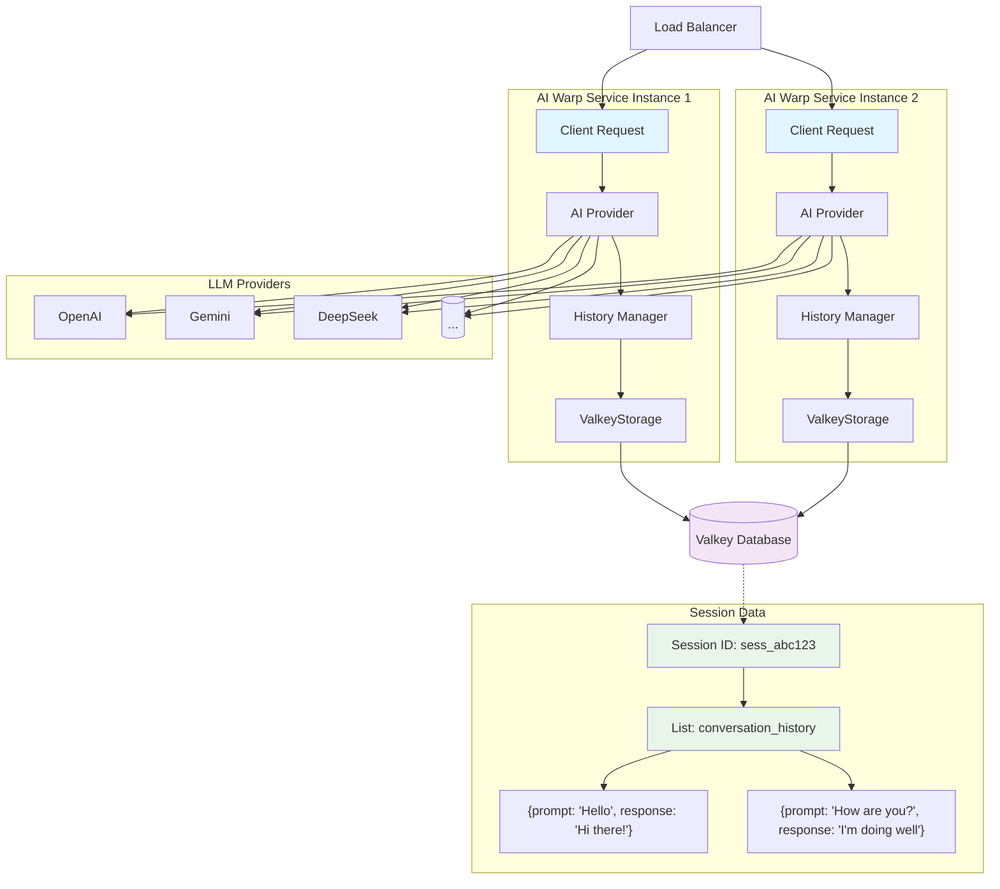

# Introducing Platformatic AI Warp 1.0.0: The Ultimate AI Gateway for Modern Applications

**The future of AI integration is here, and it's built for scale.**

Today, we're thrilled to announce the official launch of **Platformatic AI Warp 1.0.0** – the most comprehensive AI gateway solution that transforms how developers integrate multiple AI providers into their applications. After extensive development and real-world testing, we're ready to revolutionize AI development with a unified, scalable, and intelligent platform.

## The Problem We Solved

Building production-ready AI applications has been a nightmare. Developers face a maze of challenges:

- **Provider Lock-in**: Choosing one AI provider means being stuck with their limitations
- **Complex Integration**: Each provider has different APIs, authentication, and response formats
- **Reliability Issues**: No built-in fallback when your primary AI service goes down
- **Session Management**: Maintaining conversation context across requests is a headache
- **Scaling Bottlenecks**: Managing rate limits, timeouts, and connection pooling manually

Sound familiar? We've been there too.

## Enter AI Warp: Your AI Operations Command Center

Platformatic AI Warp isn't just another AI wrapper – it's a complete AI operations platform that handles the complexity so you can focus on building great features.

### 🔄 **Seamless Session Resume**

Never lose conversation context again. AI Warp maintains perfect conversation continuity across service restarts, load balancer switches, and distributed deployments:

```typescript
// Resume any conversation instantly
const response = await client.ask({
  prompt: 'What did we discuss about AI safety?',
  sessionId: 'a81bc81b-cafe-4e5d-abff-90865d1e13b1'  // Continues exactly where you left off
})
```

### 🌐 **One API to Rule Them All**

Connect to OpenAI, DeepSeek, and Google Gemini through a single, unified interface. Switch between providers without changing a single line of application code:

```typescript
// Simple string format
models: ["openai:gpt-4", "gemini:gemini-2.0-flash", "deepseek:deepseek-chat"]

// Or detailed configuration
models: [
  {
    provider: 'openai',
    model: 'gpt-4o',
    limits: { maxTokens: 4000, rate: { max: 100, timeWindow: '1m' } }
  },
  {
    provider: 'gemini',
    model: 'gemini-2.0-flash',
    limits: { maxTokens: 8000 }
  }
]
```

### 🔄 **Intelligent Automatic Fallback**

When your primary model hits rate limits or fails, AI Warp automatically tries the next model in your chain. No more 5am alerts about broken AI features:

```typescript
// Configure automatic restoration after failures
restore: {
  rateLimit: '5m',        // Retry after 5 minutes
  timeout: '2m',          // Retry after 2 minutes
  providerError: '10m'    // Retry after 10 minutes
}
```

### 💾 **Enterprise-Grade Session Management**

Maintain conversation context effortlessly with built-in session storage. Choose between lightning-fast in-memory storage or distributed Valkey/Redis for multi-instance deployments:

```typescript
// Distributed session storage
storage: {
  type: 'valkey',
  valkey: {
    host: 'localhost',
    port: 6379,
    database: 0
  }
}
```

#### How Valkey Session Storage Works

AI Warp's Valkey integration provides enterprise-grade session management through a sophisticated distributed storage architecture:



**Key Features:**
- **Distributed State**: Sessions are immediately available across all service instances
- **Automatic Expiration**: Configurable TTL prevents memory bloat (`historyExpiration: '1d'`)
- **JSON Serialization**: Efficient storage of conversation history with Redis Lists
- **Connection Pooling**: Optimized connection management with automatic reconnection
- **Cross-Instance Continuity**: Users can continue conversations on any instance

**Session Lifecycle:**
1. **Session Creation**: Auto-generated unique session ID (`a81bc81b-cafe-4e5d-abff-90865d1e13b1`)
2. **History Storage**: Each conversation turn is stored as JSON in Redis Lists using `LPUSH`
3. **Context Retrieval**: Previous conversation retrieved with `LRANGE` for AI context
4. **Automatic Cleanup**: Sessions expire based on configured TTL (default: 24 hours)

#### Session Resume: Seamless Conversation Continuity

One of AI Warp's most powerful features is seamless session resumption. Here's how it works:

**Resume Flow:**
```typescript
// Client resumes conversation with existing session ID
const response = await client.ask({
  prompt: 'What did we discuss about earlier?',
  sessionId: 'a81bc81b-cafe-4e5d-abff-90865d1e13b1'  // Previously stored session ID
})
```

**Behind the Scenes:**
1. **Session Validation**: AI Warp validates the session ID exists in Valkey
2. **History Retrieval**: Complete conversation history is fetched using `LRANGE a81bc81b-cafe-4e5d-abff-90865d1e13b1 0 -1`
3. **Context Reconstruction**: Previous conversation turns are provided to the AI model as context
4. **Contextual Response**: AI responds with full awareness of previous conversation
5. **History Update**: New conversation turn is added to the existing session

**Cross-Instance Resume:**
- User starts conversation on Instance A
- Session stored in shared Valkey cluster
- User's next request hits Instance B
- Instance B seamlessly retrieves full conversation history
- Response maintains perfect conversation continuity

**Error Handling:**
- Invalid session IDs return clear error messages
- Expired sessions gracefully start new conversations
- Storage failures fallback to stateless operation

This architecture enables true horizontal scaling - add more AI Warp instances without losing conversation state, and users can seamlessly continue conversations regardless of which instance handles their request.

### 🌊 **Real-Time Streaming**

Deliver instant, responsive AI experiences with Server-Sent Events (SSE) streaming:

```typescript
const client = buildClient({ url: 'http://localhost:3042' })

for await (const chunk of client.ask({ 
  prompt: 'Write a story about AI', 
  stream: true 
})) {
  console.log(chunk.content) // Real-time response chunks
}
```

## Built for Production from Day One

### ⚡ **Lightning Fast Performance**
- **Optimized HTTP Client**: Efficient connection reuse with [`undici`](https://github.com/nodejs/undici)
- **Connection Pooling**: Efficient resource management
- **Smart Caching**: Reduce redundant API calls

### 🛡️ **Rock-Solid Reliability**
- **Graceful Degradation**: Automatic failover between providers
- **Timeout Management**: Configurable timeouts with automatic cleanup
- **Error Recovery**: Sophisticated retry logic with exponential backoff

### 📈 **Deploy Anywhere, Scale Everywhere**
- **Self-Hostable**: Complete control over your AI infrastructure
- **Kubernetes Ready**: Native container support for cloud-native deployments
- **Universal Deployment**: Runs anywhere Node.js runs - Docker, VMs, serverless, edge
- **Distributed Architecture**: Share sessions across multiple instances
- **Rate Limit Management**: Automatic handling of provider limits
- **Resource Optimization**: Configurable limits per model and provider

## Get Started in Minutes

### Quick Start with Wattpm

```bash
mkdir my-ai-app
cd my-ai-app
npx wattpm@latest create
```

Select `@platformatic/ai-warp`, configure your API keys, and you're running a production-ready AI service in under 2 minutes.

```txt
Hello Alice, welcome to Watt 2.72.0!
? Where would you like to create your project? warp-service
? Which package manager do you want to use? npm
? Which kind of service do you want to create? @platformatic/ai-warp
? What is the name of the service? ai
? What AI providers would you like to use? OpenAI, Gemini
? What is your OpenAI API key? [hidden]
? What is your Gemini API key? [hidden]
? Do you want to create another service? no
? Do you want to use TypeScript? no
? What port do you want to use? 3042
```

Start the service

```bash
cd warp-service
npm start
```

### Install the Client

In another directory, create the client application

```bash
mkdir warp-client
cd warp-client
npm install @platformatic/ai-client
```

Create a `client.js` file with

```typescript
import { buildClient } from '@platformatic/ai-client'

const client = buildClient({
  url: 'http://localhost:3042'
})

const response = await client.ask({
  prompt: 'Hello AI, how are you today?',
  stream: false
})

console.log(response.content.text)
// "Hello! I'm doing well, thank you for asking..."
```

## Real-World Impact

**Reduced Development Time**: Teams report 80% faster AI integration compared to building custom solutions.

**Improved Reliability**: 99.9% uptime with automatic failover across multiple providers.

**Cost Optimization**: Intelligent routing and rate limiting reduce API costs by up to 40%.

**Developer Experience**: TypeScript-first design with comprehensive error handling and logging.

## What's Next?

This is just the beginning. Our roadmap includes:

- **More Providers**: Anthropic Claude, Cohere, and custom model support
- **Advanced Routing**: Cost-based and performance-based model selection
- **Analytics Dashboard**: Real-time monitoring and usage analytics
- **Plugin Ecosystem**: Custom providers and middleware support

## Join the AI Revolution

Platformatic AI Warp 1.0.0 is available now. Whether you're building a chatbot, content generator, or the next breakthrough AI application, we've got you covered.

**Ready to transform your AI development?**

- 📖 [Read the Documentation](https://github.com/platformatic/ai-warp)
- 💬 [Join our Community](https://discord.gg/platformatic)
- 🐛 [Report Issues](https://github.com/platformatic/ai-warp/issues)

**Built with ❤️ by the Platformatic Team**

*Ready to warp into the future of AI development? Get started today and experience the difference of having a true AI operations platform at your fingertips.*

---

*Follow us on [Twitter](https://twitter.com/platformatic) for updates and join our [Discord](https://discord.gg/platformatic) community to connect with other developers building the future with AI.*
