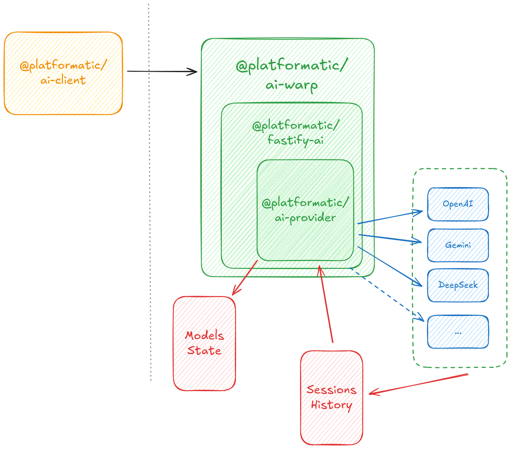

# Platformatic AI Warp

`Platformatic AI Warp` is the Platformatic solution to interact with AI model providers through a unified, scalable interface.

`@platformatic/ai-warp` offers out of the box an efficient gateway to interact with the main AI Providers through a unified interface, handling different models with fallback strategy.

## 📦 Packages

- **`@platformatic/ai-provider`** - Core implementation for AI communication with multiple providers  
  See [packages/ai-provider/README.md](./packages/ai-provider/README.md)
- **`@platformatic/fastify-ai`** - Fastify plugin for integrating AI capabilities into `fastify`  
  See [packages/fastify-ai/README.md](./packages/fastify-ai/README.md)
- **`@platformatic/ai-client`** - TypeScript client to interact with `@platformatic/ai-warp` services  
  See [packages/ai-client/README.md](./packages/ai-client/README.md)
- **`@platformatic/ai-warp`** - The AI service ready to run  
  See [packages/ai-warp/README.md](./packages/ai-warp/README.md)

## 🚀 Quick Start

### Installation

Run `@platformatic/ai-warp` with `wattpm`

```bash
mkdir warp
cd warp
npx wattpm@latest create
```

```txt
Hello Alice, welcome to Watt 2.72.0!
? Where would you like to create your project? warp-service
? Which package manager do you want to use? pnpm
? Which kind of service do you want to create? @platformatic/ai-warp
? What is the name of the service? ai
? What AI providers would you like to use? OpenAI, Gemini
? What is your OpenAI API key? [hidden]
? What is your Gemini API key? [hidden]
? Do you want to create another service? no
? What port do you want to use? 3042
```

Start the service

```bash
cd warp-service
pnpm start
```

Then make requests to warp service

```bash
curl -X POST -H "Content-type: application/json" http://127.0.0.1:3042/api/v1/prompt -d '{"prompt":"Please give me the first 10 prime numbers"}'
```

```txt
{"text":"The first 10 prime numbers are:\n\n1. 2\n2. 3\n3. 5\n4. 7\n5. 11\n6. 13\n7. 17\n8. 19\n9. 23\n10. 29","result":"COMPLETE","sessionId":"40ffaedc-bc26-4561-bc11-2e0ae2a839c1"}
```

Or use `@platformatic/ai-client`

```typescript
import { buildClient } from '@platformatic/ai-client'
import pino from 'pino'

const client = buildClient({
  url: 'http://localhost:3042',
  logger: pino({ level: 'info' })
})

const response = await client.ask({
  prompt: 'Hello AI, how are you today?',
  stream: false
})

console.log('Response:', response.content)
console.log('Headers:', response.headers)
console.log('Session ID:', response.headers.get('x-session-id'))
```

**Output:**
```json
{
  "content": {
    "text": "Hello! I'm doing well, thank you for asking. I'm here and ready to help you with any questions or tasks you might have. How are you doing today?",
    "sessionId": "a81bc81b-cafe-4e5d-abff-90865d1e13b1",
    "result": "COMPLETE"
  },
  "headers": {
    "x-session-id": "a81bc81b-cafe-4e5d-abff-90865d1e13b1",
    "content-type": "application/json"
  }
}
```

---

## ✨ Features

### 🌐 **Unified AI Provider Gateway**
Access multiple AI providers through a single, consistent interface. Switch between OpenAI, DeepSeek, and Google Gemini without changing your application code. Configure models using either simple string format (`"openai:gpt-4"`) or detailed object configuration with custom limits and retry policies.

### 🔄 **Intelligent Automatic Fallback**
When a model fails or reaches its limits, the system automatically tries the next available model in your configuration chain. This ensures maximum uptime and availability for your AI applications:
- **Model Selection**: Automatically routes requests to the next available model
- **Rate Limit Management**: Automatic handling of provider rate limits with time-window-based restoration

### 💾 **Advanced Session Management**
Maintain conversation continuity across multiple requests with persistent session storage:
- **Conversation History**: Automatic storage and retrieval of chat history
- **Multiple Storage Backends**: Support for in-memory storage and distributed Valkey
- **Session Lifecycle**: Configurable session expiration and cleanup
- **Cross-Request Context**: Session IDs available in both response body and `x-session-id` header
- **Scalable Architecture**: Sessions shared across multiple service instances

### 🌊 **Real-time Streaming Support**
Get immediate responses with Server-Sent Events (SSE) streaming:
- **Chunked Responses**: Receive AI responses as they're generated
- **Multiple Message Types**: Handle content, error, and completion messages
- **Event-based Architecture**: Support for both event-based and data-only SSE formats

### 🔄 **Intelligent Stream Resume**
Automatically recover from interrupted streaming requests without losing progress:
- **Connection Recovery**: Resume interrupted streams from the exact point of failure
- **Automatic Fallback**: Seamlessly falls back to fresh responses when resume data is unavailable
- **Session-based Continuity**: Uses session IDs to track and resume interrupted conversations
- **Network Resilience**: Handle network drops, connection timeouts, and client-side interruptions gracefully
- **Zero Data Loss**: Ensure users don't lose progress during long AI response generations
- **Configurable Resume**: Enable/disable resume functionality per request with `resume` parameter (defaults to `true`)

### 📈 **Enterprise-grade Scalability**
Built for high-throughput production environments:
- **Connection Pooling**: Efficient HTTP connection management using `undici`
- **Pipelining Optimization**: Take advantage of HTTP/1.1 pipelining for better performance
- **Shared State Management**: Distributed session and model state across service instances
- **Resource Limits**: Configurable rate limits, timeouts, and token limits per model

### 🔧 **Developer-friendly TypeScript Client**
Comprehensive TypeScript client with full type safety:
- **Type-safe Interfaces**: Complete TypeScript definitions for all API responses
- **Flexible Configuration**: Support for custom headers, timeouts, and logging
- **Pino Logger Integration**: Built-in support for structured logging
- **Error Handling**: Comprehensive error handling with detailed error types
- **Async/Await Support**: Modern JavaScript patterns with async iterators for streaming

### 🛡️ **Robust Error Handling & Recovery**
Sophisticated error handling mechanisms ensure reliability:
- **Timeout Management**: Configurable request timeouts with automatic cleanup
- **Graceful Error Recovery**: Automatic restoration of failed providers after cooling periods
- **Detailed Error Reporting**: Comprehensive error messages with context and suggestions

### 🔌 **Multi-Provider Support**
Native support for major AI providers with optimized integrations:
- **OpenAI**: Full support for GPT models
- **DeepSeek**: Integration with DeepSeek models
- **Google Gemini**: Support for Gemini Pro and Gemini Flash models
- **Extensible Architecture**: Easy to add new providers through the plugin system

## 🏗️ Architecture Overview

### Distributed Session Storage with Valkey

AI Warp's Valkey integration provides enterprise-grade session management through a sophisticated distributed storage architecture. Sessions are immediately available across all service instances, enabling true horizontal scaling:


**Key Architecture Features:**
- **Cross-Instance Continuity**: Users can continue conversations on any instance
- **Automatic Expiration**: Configurable TTL prevents memory bloat
- **JSON Serialization**: Efficient storage of conversation history
- **Connection Pooling**: Optimized connection management with automatic reconnection



## 🛣️ What's Next?

Our roadmap includes:

- **More Providers**: Anthropic Claude, Cohere, and custom model support
- **Advanced Routing**: Cost-based and performance-based model selection
- **Analytics Dashboard**: Real-time monitoring and usage analytics
- **Plugin Ecosystem**: Custom providers and middleware support

## 🤝 Community & Support

- 📖 [Documentation](https://github.com/platformatic/ai-warp)
- 💬 [Join our Discord Community](https://discord.gg/platformatic)
- 🐛 [Report Issues](https://github.com/platformatic/ai-warp/issues)
- 🐦 [Follow us on Twitter](https://twitter.com/platformatic)

**Built with ❤️ by the Platformatic Team**

## License

Apache-2.0
